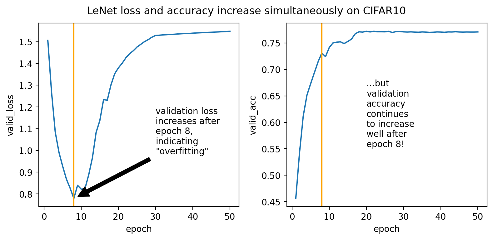
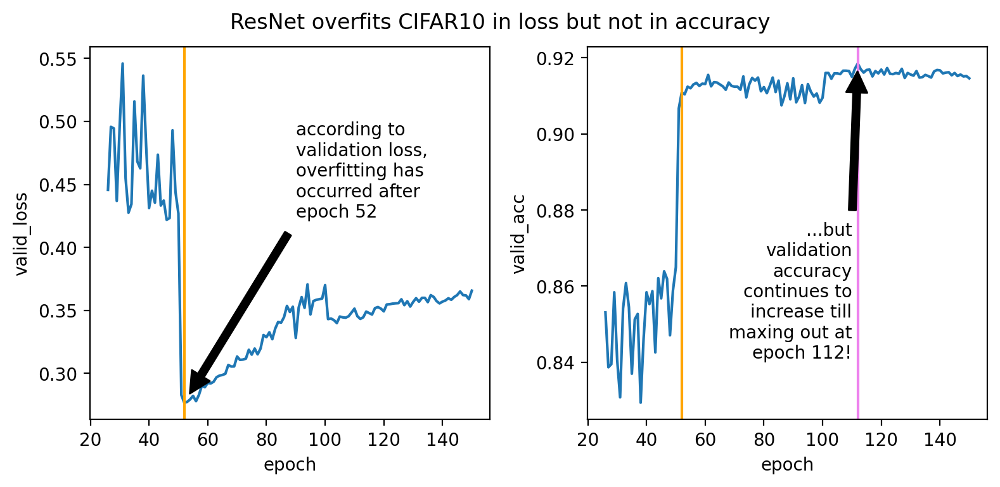
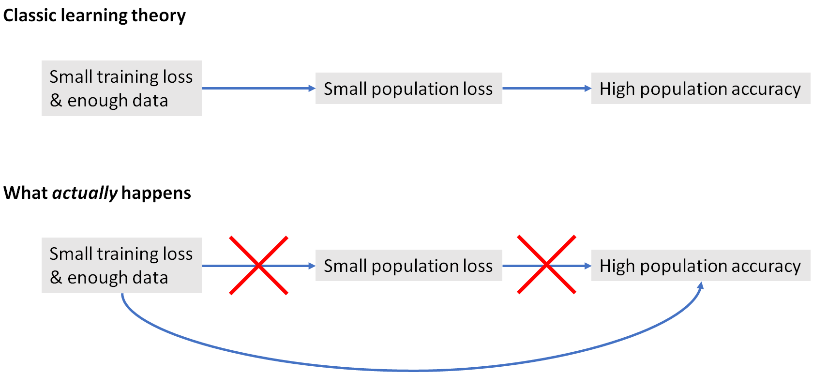
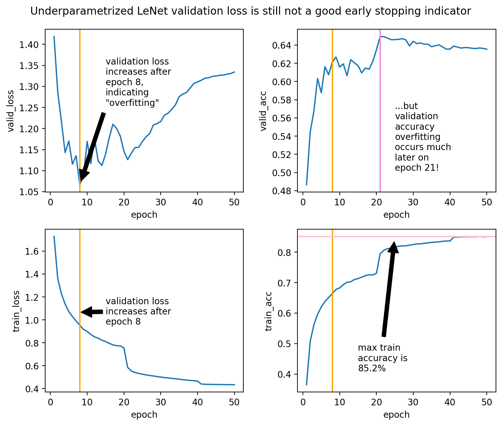
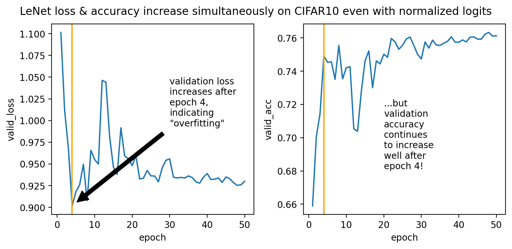

# When Loss Decreases, Accuracy Increases...Right?
...at least that seems to be the conventional wisdom.
They can sometimes go out of (anti-)sync, like the ResNet example below (noted by [Guo et al.](https://arxiv.org/abs/1706.04599)), but here we also illustrate an extreme case where loss and accuracy become almost perfectly *correlated*, like the LeNet example below.
This in particular means that, if one were to determine "overfitting" based on validation loss, one could be *way* wrong, if accuracy is the goal.
<!-- The repo here collects several simple reproductions of this phenomenon. -->

- [LeNet/CIFAR10](LeNet.ipynb)
    
    

    

- [ResNet/CIFAR10](ResNet.ipynb)

    

    

When I went back to the basics, trained some LeNets, and saw these graphs, I thought there was a bug in my code.
But nope, they are real.
This repo hopes to serve as lighthouse for others who are also confused by this.

# Wait, Hol' Up
[Guo et al.](https://arxiv.org/abs/1706.04599) framed this as a *miscalibration* problem where the neural network becomes unduly overconfident on inputs it classifies incorrectly, but I find this phenomenon more strange from a theoretical perspective, where the usual justification for training with cross entropy goes like this:

> when we train using cross entropy loss, we should get good population loss by early stopping before the validation loss goes up. Because cross entropy is a good proxy for 0-1 loss, we should also expect good population accuracy from this procedure.

But here training using cross entropy loss actually achieves good validation accuracy *in spite of* apparently overfitting the validation loss.
So the cross entropy as training loss has more going for it than just being a good proxy for the 0-1 loss, possibly some [implicit regularization effect](https://arxiv.org/abs/1710.10345)?

# Weird Phenomenon But OK?
I don't think this observation is useful for settings where we have better validation metrics we can track, such as accuracy in classification tasks or BLEU score in machine translation.
But this does provoke some thoughts in domains like language modeling where loss/perplexity is the primary metric --- when we stop training early based on validation perplexity, are we sure we are not stopping *too early*, if our goal is to learn language?

# Twitter Discussion

There was a [discussion on twitter](https://twitter.com/TheGregYang/status/1260620346992087040?s=20) regarding this phenomenon.
I ran some more experiments in response to some comments there.
These results suggest the situation is more nuanced than one might think.

- **Underparametrization.** A [few](https://twitter.com/joshim5/status/1260693557352022020?s=20) [comments](https://twitter.com/PreetumNakkiran/status/1260632443704324096?s=20) suggested that underparametrized networks most likely won't see this misleading validation loss overfitting. I trained a smaller LeNet that gets <90% training accuracy but still see the phenomenon. So, in language modeling with large datasets (and relatively underparametrized models), we still have reason to not trust perplexity too much.

    [Notebook](LeNet-Small.ipynb)

    

    

- **Normalization.** Quite a few comments [[1](https://twitter.com/AnimaAnandkumar/status/1260635929074491392?s=20), [2](https://twitter.com/PreetumNakkiran/status/1260627311721775104?s=20), [3](https://twitter.com/deepcohen/status/1260629937595330560?s=20), [4](https://twitter.com/jxbz/status/1260644000681177088?s=20)] suggested that if the weights or logits are normalized in some way, then we wouldn't see this misleading validation loss overfitting. I put batchnorm on every layer and also a final layer norm (without affine parameters) on the logits, but still see the phenomenon, though here the validation loss doesn't blow up nearly as much as before.

    [Notebook](LeNet-Normalized-Logits.ipynb)

    

    

# Some Related Links

- https://stackoverflow.com/questions/40910857/how-to-interpret-increase-in-both-loss-and-accuracy
- https://stats.stackexchange.com/questions/278951/both-validation-loss-and-accuracy-goes-up-in-neural-network
- https://stats.stackexchange.com/questions/368431/can-it-be-over-fitting-when-validation-loss-and-validation-accuracy-is-both-incr
- http://www.jussihuotari.com/2018/01/17/why-loss-and-accuracy-metrics-conflict/
- https://stats.stackexchange.com/questions/282160/how-is-it-possible-that-validation-loss-is-increasing-while-validation-accuracy
- https://stats.stackexchange.com/questions/258166/good-accuracy-despite-high-loss-value/281651#281651

# Request for Contribution
File a pull request if

- you have other clean examples of this (where loss and some quality metric increase simultaneously on the validation set), especially outside of image classification or with losses other than cross entropy
- you have a nice, simple explanation of this phenomenon, written in markdown or a jupyter notebook
- you have relevant literature you'd like to link here
